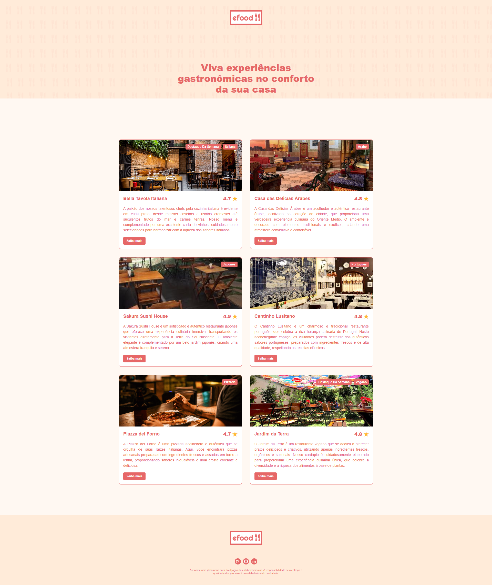

# 🍽️ Efood - Projeto EBAC

Aplicação de delivery gastronômico, desenvolvida como parte da formação na EBAC, com React, Styled Components, React Router e Redux Toolkit.

---

## 📸 Preview da Página Inicial



---

## ✅ Checklist das Entregas

### Parte I - Estrutura e Estilo Inicial
- [x] Criar as telas conforme imagens layout-1parte-Home.png e layout-1parte-Perfil.png
- [x] Criar um novo projeto React
- [x] Utilizar Styled Components para estilização
- [x] Utilizar React Router para navegação entre páginas

### Parte II - Integração com API + Modal
- [ ] Criar modal ao clicar em "comprar produto"
- [ ] Preencher a página com dados da API: [fake-api-efood](https://fake-api-tau.vercel.app/api/efood/restaurantes)

### Parte III - Carrinho com Redux
- [ ] Criar página de carrinho com os produtos adicionados
- [ ] Calcular o total com base nos produtos no Redux

### Parte IV - Checkout e Confirmação
- [ ] Criar formulário de entrega
- [ ] Criar tela de pagamento
- [ ] Criar tela de confirmação do pedido
- [ ] Enviar POST ao finalizar pedido e exibir resposta da API

---

## 🚀 Tecnologias Utilizadas

<p align="left">
  
  
  
  
  
  
  
</p>

---

## 📂 Estrutura de Pastas

```bash
efood/
├── public/
│   ├── assets/
│   └── readme/pagina1.png
├── src/
│   ├── components/
│   ├── pages/
│   ├── store/
│   └── styles/
└── README.md
```

---

## 👩‍💻 Desenvolvido por  
**Viviane Aguiar**  
📧 [vivianeaguiarc@outlook.com](mailto:vivianeaguiarc@outlook.com)

### 🌐 Redes Sociais

[](https://www.linkedin.com/in/vivianezzt/)
[](https://github.com/vivianezzt)
[](https://instagram.com/vivianezzt)
